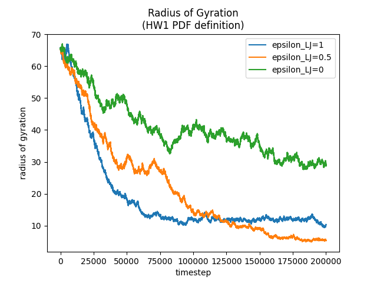
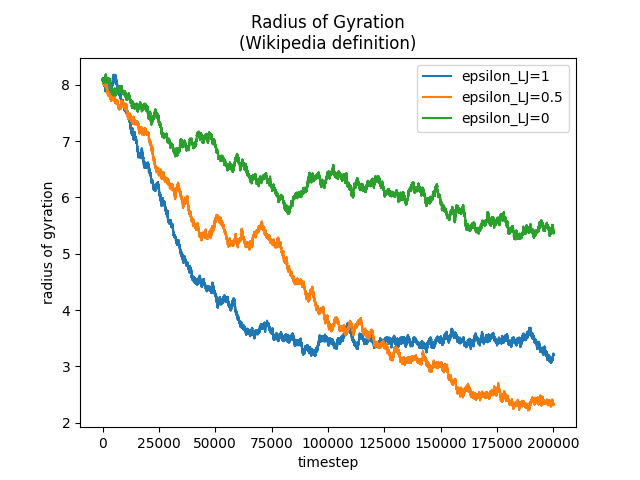

# Coarse Grained Simulation of a Protein
Part one of this homework assignment is to run a simple coarse grained protein folding simulation.
## (1) Investigating varying N
For part one of part one of this homework, we are to prepare a plot of the radius of gyration showcasing simulations run for varying `N`, the # of monomers in the chain, or just the length of the chain. The first step is to write a function to calculate the radius of gyration.

The homework assignment gives an equation for the radius of gyration, but I wasn't feeling certain about how to interpret the squaring of a vector. The way that I first decided to do it was to sum up the squared distances between `r_i` and `r_j` (i.e. the magnitude of the differences), rather than the raw differences between `r_i` and `r_j`. Then later on I remembered that a more proper way to interpret squaring a vector was to take the dot product with itself. Luckily for me, the squared magnitude of a vector (the initial solution I went with), is the same thing as a vector dot product with itself. This inspired me to fix/speed up my code by removing a redundant square root followed by a squaring. This is the function for that version of the radius of gyration:
```python
def radius_of_gyration(N, x):
    sum_rad_gy = 0
    for i in range(0, N):
        for j in range(0, N):
            if not i == j:
                diff = (x[i, :] - x[j, :])
                sum_rad_gy += (diff[0] * diff[0] + diff[1] * diff[1])
    return sum_rad_gy / (2 * N * N)
```
I still wasn't feeling 100% trustworthy of that function however. So I decided to also try also learning about the radius of gyration from the internet's most reputable source: Wikipedia. According to Wikipedia, the radius of gyration for a set of points is the root mean square of the distances of each point from the center of mass of all the points. So I wrote a function to first calculate the center of mass, and then calculate the RMS of the distance of each point from that center of mass:
```python
def radius_of_gyration_rms(N, x):
    center_of_mass = np.zeros(2)
    sum_rad_gy = 0
    for i in range(0, N):
        center_of_mass += x[i, :]
    center_of_mass /= N
    for i in range(0, N):
        diff = (center_of_mass - x[i, :])
        sum_rad_gy += (diff[0] * diff[0] + diff[1] * diff[1])
    return math.sqrt(sum_rad_gy / N)
```
Now with both functions completed, I could compare them by plotting both values as functions of time, for each of the `N = 25, 20, 5`. The version from the HW1 PDF is shown first below, and the Wikipedia definition is shown second. Both are very similar, and show the same overall behavior throughout the simulation: the radius of gyration starts high and decreases throughout the simulation, reaching close to it's minimum by 100,000 steps for `N = 25` and `N = 20`. But the short polymer, with a length of just `N = 5` reaches near its minimum radius of gyration much quicker, around 10,000 steps.
 
The major difference between the two graphs (using the two different radius of gyration definitions), is that the Wikipedia definition is consistently on the scale of about a square root of the HW1 PDF version. This is kind of to be expected however, because aside from a square root, the two different functions are essentially doing the same thing. The only real difference between the two, other than the square root, is that the HW1 version is summing N times more interactions, because it is taking the average distance between two particles in the system, rather than the average distance of each particle from one given point (the center of mass). And this N times more sums is also accounted for in the difference between the two functions: one is divided by an `N^2` at the end while the other is divided by just a `sqrt(N)`.


## (2) Investigating varying LJ potential strengths
The second part of the first part of the homework is very similar to the first part of the first part, in that we are running a parameter sweep, and investigating the radius of gyration across the parameter sweep. The only thing that has changed since the first part is that we are no longer investigating differences in `N`, the chain length, and instead we are investigating differences in `epsilon_LJ`, the strength of the Lennard-Jones potential. Once again I decided to just use both functions for the radius of gyration simultaneously.

Here, the HW1 PDF version and the Wikipedia version follow the same relationship as discussed before. As for why the versions of the simulation follow the trend of starting high if `epsilon_LJ = 1`, and low otherwise, I'm really not sure. I'm not even sure if this is supposed to be the behavior I should expect. But I don't have enough time to do any more investigating, these simulations can take quite some time, and I got distracted trying to have fun and make gif animations of these simulations.




All of the graphs for these two sections were created with a quick and dirty function that loads the data from a file and uses pyplot to create the graphs and save them as .png's for me. I decided to save the data to a .npy file at the end of simulation, and load it again from the file at the beginning of visualization, because it allowed me to make as many small and incremental changes as I wanted to the visualization functions without requiring me to go back and re-run the simulation(s) over and over again.

```python
def plot_radius_of_gyration(in_file, out_file, title, legend):
    radii = np.load(in_file)
    for radius in radii:
        plt.plot(np.arange(1, len(radius) + 1), radius)
    plt.title(title)
    plt.legend(legend)
    plt.xlabel("timestep")
    plt.ylabel("radius of gyration")
    plt.savefig(out_file, format="png")
    plt.clf()
```
