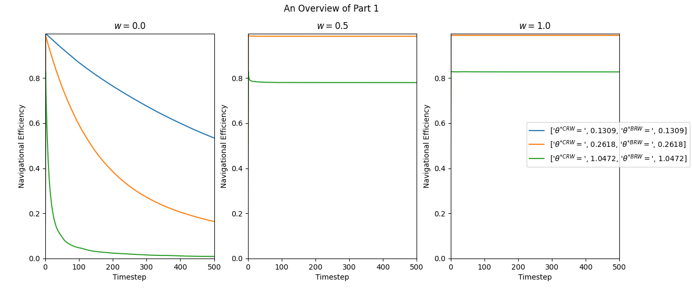
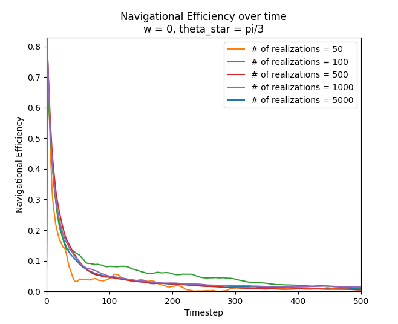

# CSCI 5314 - HW 2
If you are reading this in PDF form, it is also available online as just a GitHub rendered markdown file! Read it at [github.com/peterrosenthal/csci-dynamic-models-in-biology/tree/main/HW2/WRITEUP.md](https://github.com/peterrosenthal/csci-dynamic-models-in-biology/tree/main/HW2/WRITEUP.md).

You can also read through my (altered version of the starter) code at [github.com/peterrosenthal/csci-dynamic-models-in-biology/tree/main/HW2/random_walks.py](https://github.com/peterrosenthal/csci-dynamic-models-in-biology/tree/main/HW2/random_walks.py) if you so desire.

## Simulation of Random Walks

### Part 1
In order to create these figures, I made a change to the code which allowed me to calculate the navigational efficiency at each timestep instead of just once at the end of the simulations. After running it once, I was disappointed at how noisy and random the `w = 0` case was, especially when `theta_star_crw = theta_star_brw = pi / 3`. I knew that should kind of be expected when dealing with random numbers, but I also knew that because it's a random number based simulation, it was really a problem of having too small of a data-set to average over (not enough realizations). So because my computer could handle it, and I wanted that smooth smooth data, I decided to increase the number of realizations by 2 orders of magnitude, and run with 5000 realizations instead of just 50.

To show how the data was getting smoother with more and more realizations, I decided to make a second plot for this part, featuring just the case where `w = 0` and `theta_star = p / 3`, but featuring the navigational efficieny of 50, 100, 500, 1000, and 5000 realizations. I find this plot really satisfying because it shows how much "better" (I know that better is maybe not the right term here) my data is than it would be if I hadn't increased the number of realizations.

### Part 2
To find the best weight for this specific set of `theta_star_crw` and `theta_star_brw`, I simulated 500 different weights between 0.0 and 1.0, saved all the data along the way, and used built in max-finding functions to find the index of the maximum efficieny in the array with all the data, and then from that index, I knew which weight was the best. I probably (read: definitely) didn't need to simulate all 500, I could have gone for a much lower resolution, and used interpolation to find the lowest value between grid points. But `N` was already 500, and I had also increased the number of realizations to 500, so setting the number of different weights to simulate to also be 500 just felt... nice.

The technique described above gave me the result: `w = 0.0661`

I also decided to prepare a contour plot of these 2 dimensions of data, because science gets more exciting the more pretty graphs you get to look at. I placed a horizontal dashed line at the weight of peak efficiency to help the reader make the connection from the number they just read to the picture they're about to read. *A note about the graph: I used to have a plot with smooth contour lines because I did run it at 500 realizations, but I somehow nolonger have that plot or data and didn't have enough time to re-run it with that many realizations, so I'm stuck with these noisy contour lines from noisy data intsead...*

## Paper Review: "Evaluating random search strategies in three mammals from distinct feeding guilds" by Auger-Methe et. al
I thought that this was a really fun paper to read, mainly because I think bears and caribou (and all animals) are really cool. The main goal/contribution of the paper was to provide evidence to against the use of the truncated Levy walk (TLW) as a random search strategy in mammals, a model which historically has had a lot of support. They did this by collecting long term movement data on three different species (caribou, grizzly bear, and polar bear) with very different diets and thus food gathering styles, and then comparing the real-world data to variuous models to find which model fit their movements best. They found that when comparing to two kinds of composite correlated random walk (CCRW), a correlated random walk (CRW), and a Brownian walk (BW), none of the animals accross all three species showed the TLW as the best model to fit their data. When the most common best fit models (CCRW and CRW) were removed from the pool of contenders however, the TLW model more often than not beat out the BW model, showing how when less sophisticated models are considered, the TLW can look like a very convincing option. They also plotted the probability density functions for step length distribution as well as turning angle distribution for all of the different models, and compared them to the observed density/distribution of those quantities. This showed that the linear behaivior of the TLW model in these densities is not reflected in the data, which fits much better to the other models.

The essential priciple the researchers are "exploiting", or the principle that fundamentally paves the way and allows them to do this reasearch, is a method that the same researcher had published a year prior that gives them the ability to determine how good of a fit the model is to the real-world data. They didn't go into much specifics on how or what this model is though, because it was covered (assumedly extensively) in a different paper. They did mention however, that the method defines likelihood functions to determine how likely a model would create such data, and that these likelihood functions are then assessed using the seccond-order Akaike Information Criterion which I have no idea what it is, and I'm just going to leave it at that.

The strongest part of the paper to me was their discussion section where they covered their butts and talked about almost all of their weaknesses and gave great explanations for all of them. In particular I was pleased by the way that they explained that despite the CCRW almost always being the best fit model, none of the models actually fit the data from any polar bears well enough to be considered "the right" model (). They explained how that was likely because of intentional navigational behavior made by the polar bears, and that sometimes purely random is not how everything should be modeled. And they also pointed out that the lack of a perfect fit from any of the models for polar bears is just more evidence for another better model to discovered in the future that outperforms the CCRW, just like the researchers are advocating for the CCRW outperforming the TLW right now.

To me, the weakest part of the paper was when they found strong evidence supporting two distinct phases of searching (intensive vs extensive) for grizzly bears and polar bears but not for caribou. They gave several explanations why, including the posibility for behavioral differences between bears and caribou, and also including the possibility of it being statistical issues; they said that the caribou was their smallest dataset by far. But I was a bit shocked when I got to an unrelated part later in the paper in the discussion section to find that their caribou movement data was also only sampled daily compared to the every 4 hours of the grizzly and polar bears. I feel like surely the intensive search phase happens on much too short of a timescale to be detected by such a low sample rate as just daily, and I would love to see this looked into further with a higher sample rate on the caribou movement data.

Other than that, I would also love to see this work replicated on a much larger set of animals, more/different species. It got me interested in seeing how different animals move, and now I want to see it all! They also mentioned the half-domestication of European reindeer (also caribou) as a potential issue in observing animal movement, not in their own paper but in another work they were referencing. That got me interested in how domestication would actually change random walk strategies in animals; what specifically is domestication impacting there? That study could involve wolves and dogs possibly as an example.